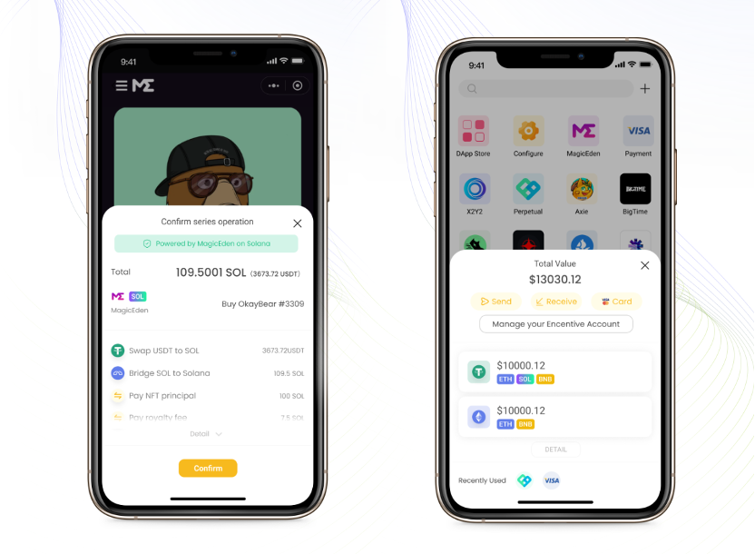

# 🔳 Mini-Program platform

DappOS akan meluncurkan sebuah platform mini program pada perangkat telepon untuk menghadirkan pengalaman pengguna saat mengakses dApps serupa pada saat menjelajahi web2. Dibandingkan dengan dompet tradisional, keuntungan utamanya adalah sebagai berikut:

**Akun**

* Bebas dari frasa pemulihan, dan dukungan pada metode manajemen admin yang jauh lebih mudah untuk digunakan seperti [pemulihan melalui perangkat](akun-dappos/metode-pemulihan/setel-dari-perangkat-lain.md) dan[ login via email](akun-dappos/metode-pemulihan/setel-via-e-mail-dkim-based.md).
* Akun gabungan serupa dengan CEX. Pengguna tidak harus pusing dengan rincian dari chain public. Pengguna cukup mengetahui total nilai dari aset, tanpa memikirkan pada chain mana itu berada. Pembayaran terkombinasi dapat dengan mudah direalisasi.

**Interaksi dApp**

* Ketika berinteraksi dengan dApp, klien pengguna tidak lagi pusing dengan pembayaran gas, bridge aset, persetujuan, dan langkah interaksi dengan kontrak lainnya. Klien pengguna cukup mengkonfirmasi total biaya yang dikeluarkan, cukup dengan mengklik confirm, dan semua interaksi akan terselesaikan secara otomatis. Selain dari itu, pengalaman pengguna akan sama dengan aplikasi pada web2.

<figure><figcaption></figcaption></figure>
